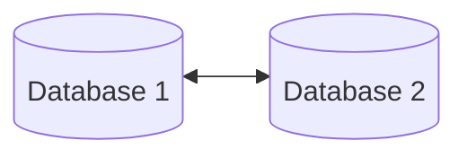

Link to MD [Cheat Sheet](https://www.markdownguide.org/cheat-sheet/)
Link til [Obsidian Help](https://help.obsidian.md/) 
Link til [Mermaid](https://mermaid.js.org/intro/)
Link til [Toggl plug-in](https://github.com/mcndt/obsidian-toggl-integration/wiki/Toggl-Query-Language-(TQL)-Reference)


[Import from OneNote](https://forum.obsidian.md/t/new-tool-for-migration-from-onenote-updated-and-improved-version/3055)


## Mermaid



<iframe src="https://help.obsidian.md/" width="100%" height="800px"></iframe>


```dataviewjs
dv.table(["Navn", "Dato"], dv.pages('"People"') 
		 .where(b => b.location == "aarhus") 
		 .where(b => b.tags == "person") 
		 .sort(b => b.file.link) 
		 .map(b => [b.file.link, b.date_last_spoken]))
```

## Callouts
---
> [!note]
> Lorem ipsum dolor sit amet

---

> [!abstract]
> Lorem ipsum dolor sit amet

Aliases: `summary`, `tldr`

---

> [!info]
> Lorem ipsum dolor sit amet

---

> [!todo]
> Lorem ipsum dolor sit amet

---

> [!tip]
> Lorem ipsum dolor sit amet

Aliases: `hint`, `important`

---

> [!success]
> Lorem ipsum dolor sit amet

Aliases: `check`, `done`

---

> [!question]
> Lorem ipsum dolor sit amet

Aliases: `help`, `faq`

---

Warning
> [!warning]
> Lorem ipsum dolor sit amet

Aliases: `caution`, `attention`

---

Failure
> [!failure]
> Lorem ipsum dolor sit amet

Aliases: `fail`, `missing`

---

Danger
> [!danger]
> Lorem ipsum dolor sit amet

Alias: `error`

---

> [!bug]
> Lorem ipsum dolor sit amet

---

> [!example]
> Lorem ipsum dolor sit amet

---

> [!quote]
> Lorem ipsum dolor sit amet

Alias: `cite`