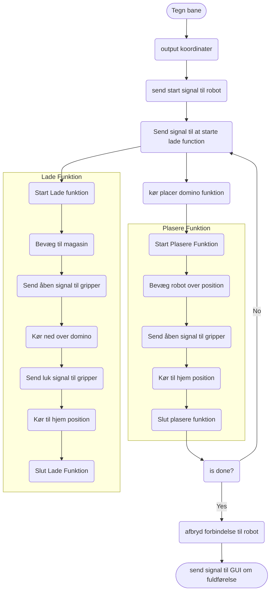

```mermaid
graph TD
a([Tegn bane]) -->b(output koordinater)-->
c(send start signal til robot)-->
d(Send signal til at starte lade function)-->
e(kør placer domino funktion)
f(is done?)-->|No|d
f-->|Yes|g(afbryd forbindelse til robot)-->
h([send signal til GUI om fuldførelse])

d-->a1

subgraph Lade Funktion
a1(Start Lade funktion)-->
a2(Bevæg til magasin)-->
a3(Send åben signal til gripper)-->
a31(Kør ned over domino)-->
a32(Send luk signal til gripper)-->
a4(Kør til hjem position)-->
a5(Slut Lade Funktion)
end

e-->b1

subgraph Plasere Funktion
b1(Start Plasere Funktion)-->
b2(Bevæg robot over position)-->
b3(Send åben signal til gripper)-->
b4(Kør til hjem position)-->
b5(Slut plasere funktion)
end

b5-->f

```