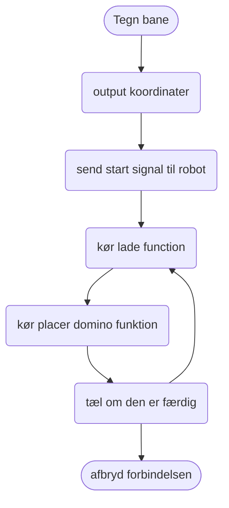

```mermaid
graph TD
a([Tegn bane]) -->b(output koordinater)-->
c(send start signal til robot)-->
d(kør lade function)-->
e(kør placer domino funktion)-->f(tæl om den er færdig)-->d
f-->g([afbryd forbindelsen])

```