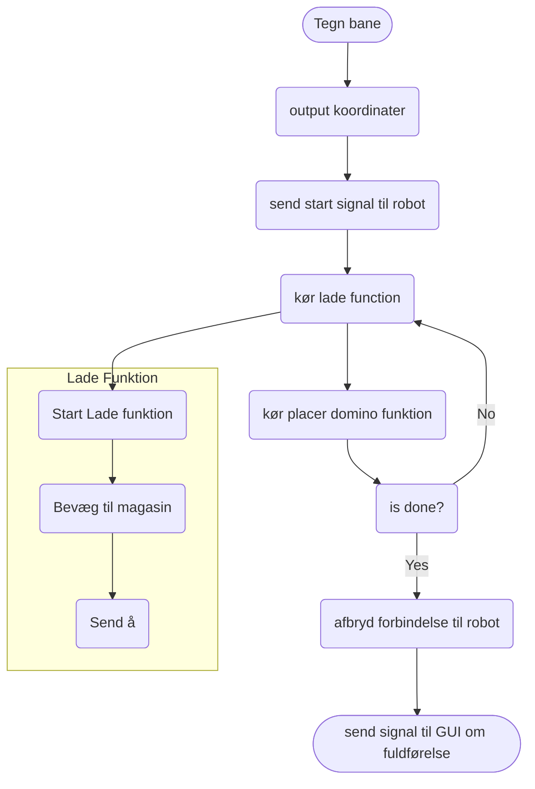

```mermaid
graph TD
a([Tegn bane]) -->b(output koordinater)-->
c(send start signal til robot)-->
d(kør lade function)-->
e(kør placer domino funktion)-->f(is done?)-->|No|d
f-->|Yes|g(afbryd forbindelse til robot)-->
h([send signal til GUI om fuldførelse])

d-->a1

subgraph Lade Funktion
a1(Start Lade funktion)-->
a2(Bevæg til magasin)-->
a3(Send å)
end

```